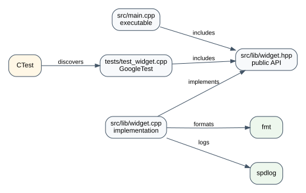

# myproject Design Docs

This directory contains project-specific design documentation for `myproject`.
The root repository README files describe the development environment; these
documents describe this C++ project.

## Documents

- [Architecture](architecture.md): source layout, build targets, dependency
  direction, and test boundary.

## Layout

```text
doc/
+-- README.md
+-- architecture.md
+-- img_src/
|   +-- architecture.dot
+-- img/
    +-- architecture.svg
```

## Image Sources

`img_src/` contains editable text sources for generated documentation images.
Graphviz DOT and PlantUML files are acceptable source formats.

Use matching basenames where practical:

```text
img_src/architecture.dot -> img/architecture.svg
```

## Generated Images

`img/` contains generated image files referenced by Markdown documents. Prefer
SVG for diagrams because it stays crisp in Markdown renderers and works well in
source control.

Generated images are committed so the design docs render without requiring local
diagram tooling.

## Linking

Markdown documents use relative links from `doc/`:

```markdown

```

